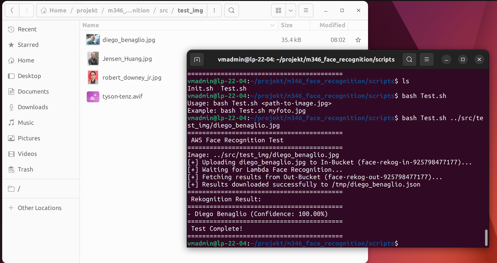
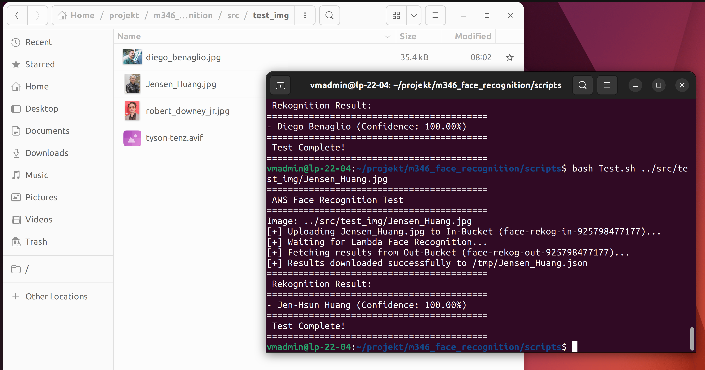
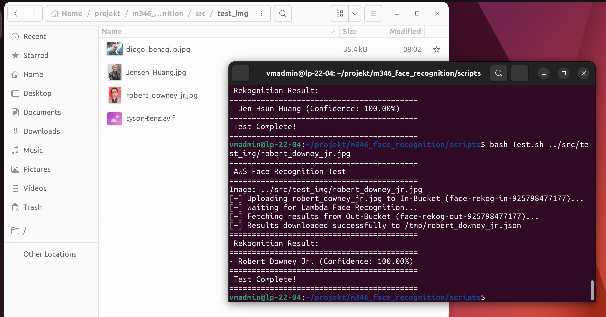
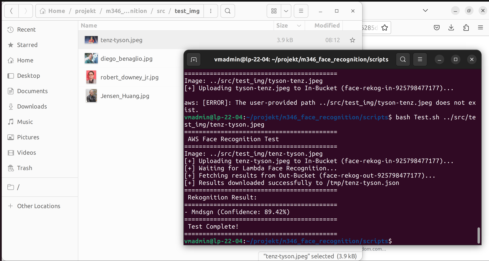
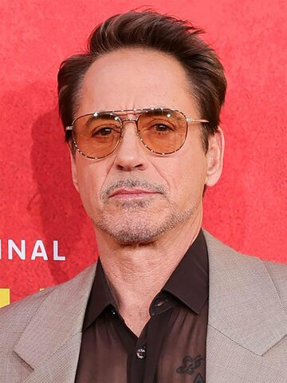

# Projektdokumentation M346 - Face Recognition Service

## 1. Projektuebersicht

### 1.1 Ausgangslage

Im Rahmen von Modul 346 wird ein Cloud-Service implementiert, der ein Bildereignis automatisiert verarbeitet und das Analyseergebnis strukturiert ablegt.

### 1.2 Projektziel

Ziel ist die Realisierung eines serverlosen Workflows auf AWS, der bekannte Persoenlichkeiten auf Bildern erkennt.

Kernanforderungen:

- Event-getriebene Verarbeitung
- Automatisiertes Deployment
- Nachvollziehbare Tests
- Saubere technische Dokumentation

### 1.3 Team

- Jonas Rutz
- Alexej

## 2. Anforderungen und Scope

### 2.1 Funktionale Anforderungen

- Beim Upload eines Bildes in den Input-Bucket wird automatisch eine Lambda-Funktion gestartet.
- Die Lambda-Funktion analysiert das Bild mit AWS Rekognition (`RecognizeCelebrities`).
- Das Resultat wird als JSON im Output-Bucket gespeichert.
- Ein Testskript soll den End-to-End-Ablauf reproduzierbar validieren.

### 2.2 Nicht-funktionale Anforderungen

- Reproduzierbarkeit durch Skripte
- Wartbarkeit durch klare Struktur und Trennung der Verantwortungen
- Nachvollziehbarkeit durch Logs und Dokumentation
- Zuverlaessiger Betrieb im Lab-Setup

## 3. Architektur und Datenfluss

### 3.1 Komponenten

- Amazon S3 Input-Bucket: Bild-Upload und Event-Quelle
- AWS Lambda: Verarbeitung des Upload-Events
- Amazon Rekognition: Erkennung bekannter Persoenlichkeiten
- Amazon S3 Output-Bucket: Persistenz der Analyse als JSON
- CloudWatch Logs: Laufzeit- und Fehlernachweise

### 3.2 Ablaufdiagramm

```text
Client/Terminal
    |
    | Upload Bild
    v
S3 Input Bucket (ObjectCreated Event)
    |
    | Trigger
    v
AWS Lambda (lambda_function.py)
    |
    | Rekognition API Call
    v
AWS Rekognition (RecognizeCelebrities)
    |
    | JSON Response
    v
S3 Output Bucket (<bildname>.json)
    |
    | Download
    v
Test.sh (lesbare Konsolenausgabe)
```

### 3.3 Datenobjekte

Input:

- Bilddatei (`.jpg`, `.jpeg`, `.png`) im Input-Bucket

Output:

- JSON-Datei mit denselben Basisnamen wie das Eingabebild
- Struktur mit u.a. `CelebrityFaces`, `UnrecognizedFaces`, Confidence-Werten

## 4. Implementierung

### 4.1 Lambda-Funktion (`src/lambda_function.py`)

Verantwortung:

- Event-Daten auslesen
- Bildobjekt an Rekognition uebergeben
- Antwort in JSON serialisieren
- Ergebnisobjekt im Output-Bucket ablegen

Wichtige technische Punkte:

- `OUT_BUCKET` wird als Umgebungsvariable gesetzt
- Dateiname wird von Bild-Endung auf `.json` umgestellt
- Fehlerbehandlung ueber `try/except` mit klaren Logs

### 4.2 Deployment-Skript (`scripts/Init.sh`)

Verantwortung:

- AWS Account-ID bestimmen
- Bucket-Namen konstruieren
- Buckets idempotent erstellen
- Lambda verpacken und bereitstellen
- Trigger und Berechtigungen konfigurieren

Wichtige technische Punkte:

- `set -e` fuer sofortigen Abbruch bei Fehlern
- Update-Pfad fuer bestehende Lambda-Funktion
- S3->Lambda Permission wird sauber erneuert

### 4.3 Test-Skript (`scripts/Test.sh`)

Verantwortung:

- Bild in Input-Bucket hochladen
- Auf Verarbeitung warten
- JSON-Resultat holen
- Relevante Infos lesbar ausgeben

Wichtige technische Punkte:

- Validierung der Eingabeparameter
- Fallback zwischen `python3` und `python`
- Hinweise bei fehlender Resultatdatei

## 5. Installation und Betrieb

### 5.1 Erstinstallation

```bash
cd scripts
bash Init.sh
```

### 5.2 End-to-End-Test

```bash
cd scripts
bash Test.sh ../pfad/zum/bild.jpg
```

### 5.3 Betriebskontrolle

- CloudWatch Logs fuer `FaceRekognitionFunction` pruefen
- Output-Bucket auf erzeugte JSON-Datei pruefen
- Bei Fehlern IAM-Rolle, Region und Bucket-Namen kontrollieren

## 6. Testkonzept und Nachweise

### 6.1 Testprotokoll (durchgefuehrt am 24.03.2026)

Rahmendaten:

- Testperson: Jonas Rutz
- Tool: `scripts/Test.sh`
- Testzeitpunkte: 08:08, 08:09, 08:10, 08:11
- Ziel: End-to-End-Nachweis des Workflows Upload -> Trigger -> Analyse -> JSON-Resultat

| Zeit  | Eingabebild                     | Erwartung                                     | Resultat                                | Screenshot                                                                    | Richtig erkannt |
| ----- | ------------------------------- | --------------------------------------------- | --------------------------------------- | ----------------------------------------------------------------------------- | --------------- |
| 08:08 | `test_img/diego_benaglio.jpg`   | Bekannte Persoenlichkeit wird korrekt erkannt | Diego Benaglio (Confidence: 100.00%)    |     | Ja              |
| 08:09 | `test_img/Jensen_Huang.jpg`     | Bekannte Persoenlichkeit wird korrekt erkannt | Jen-Hsun Huang (Confidence: 100.00%)    |    | Ja              |
| 08:10 | `test_img/robert_downey_jr.jpg` | Bekannte Persoenlichkeit wird korrekt erkannt | Robert Downey Jr. (Confidence: 100.00%) |  | Ja              |
| 08:11 | `test_img/tenz-tyson.jpeg`      | Test auf Grenzfall und Modellrobustheit       | Mndsgn (Confidence: 89.42%)             |    | Nein            |

### 6.2 Ergebnisbewertung pro Testfall

1. `diego_benaglio.jpg` (08:08)
- Bewertung: bestanden
- Erkenntnis: Das System erkennt die Person mit 100.00% und gibt den Namen benutzerfreundlich aus.
- Empfehlung: Keine Massnahme erforderlich.
2. `Jensen_Huang.jpg` (08:09)
- Bewertung: bestanden
- Erkenntnis: Korrekte Identifikation bei hoher Bildqualitaet mit 100.00%.
- Empfehlung: Keine Massnahme erforderlich.
3. `robert_downey_jr.jpg` (08:10)
- Bewertung: bestanden
- Erkenntnis: Korrekte Identifikation mit 100.00%; Ausgabeformat ist konsistent.
- Empfehlung: Keine Massnahme erforderlich.
4. `tenz-tyson.jpeg` (08:11)
- Bewertung: teilweise bestanden (technisch korrekt, fachlich abweichender Name)
- Erkenntnis: Rekognition liefert fuer dieses Bild eine andere bekannte Persoenlichkeit mit 89.42%.
- Empfehlung: In der Doku als Modellgrenze festhalten; optional Schwellwert oder Plausibilitaetspruefung ergaenzen.

Zusatzbeobachtung zum Ablauf:

- Vor dem erfolgreichen 08:11-Lauf wurde ein falscher Dateiname verwendet (`tyson-tenz.jpeg` statt `tenz-tyson.jpeg`), was zu einem erwartbaren Pfadfehler fuehrte.
- Nach Korrektur des Dateinamens wurde der Test erfolgreich ausgefuehrt und protokolliert.

### 6.3 Abgleich mit den Zielen aus lernziele.json

Abgedeckte Projektziele aus Abschnitt 1.2 (Seite 2 im JSON-Extrakt):

| Ziel aus lernziele.json                                              | Umsetzungsnachweis im Projekt                                            |
| -------------------------------------------------------------------- | ------------------------------------------------------------------------ |
| 1. Cloud Service zur Erkennung bekannter Persoenlichkeiten auf Fotos | Vier reale Testfaelle mit Erkennungsresultat und Confidence dokumentiert |
| 2. Bereitstellung im AWS Learner-Lab                                 | Tests wurden ueber CLI-Skripte im laufenden AWS-Setup ausgefuehrt        |
| 3. Versionierung und Verwaltung im Git-Repository                    | Artefakte und Dokumentation liegen versioniert im Projekt ab             |
| 4. Dokumentation als Markdown                                        | Dieses Testprotokoll ist Teil der Markdown-Dokumentation                 |
| 5. Test und Protokollierung                                          | Alle Testfaelle wurden mit Zeitstempel und Screenshot protokolliert      |

Abgleich mit den Bewertungszielen (Leitfragen) aus lernziele.json:

| Leitfrage                    | Anforderung (Kurzfassung)                                                                        | Nachweis in dieser Doku                                                      |
| ---------------------------- | ------------------------------------------------------------------------------------------------ | ---------------------------------------------------------------------------- |
| A4 Tests                     | Screenshots, korrekte und uebersichtliche Resultate, Testzeitpunkt, Testperson, Fazit/Massnahmen | Tabelle 6.1 + Bewertung 6.2 + Empfehlungen je Testfall                       |
| A5 Erkennungsfunktionalitaet | Bekannte Personen auf Fotos erkennen und Name/Resultat liefern                                   | Drei korrekte Erkennungen mit 100.00% sowie ein dokumentierter Grenzfall     |
| A6 AWS-Komponenten           | Upload triggert Verarbeitung, Resultate als JSON im Out-Bucket                                   | Erfolgreiche End-to-End-Laeufe mit Download der Resultate ueber `Test.sh`    |
| A7 Automatisierungsgrad      | Test-Skript laedt hoch, wartet, holt JSON, gibt Name + Trefferwahrscheinlichkeit aus             | Konsolennachweise in allen vier Resultat-Screenshots                         |
| C5/C6 Dokumentationstechnik  | Markdown, Bilder/Tabellen sinnvoll und technisch korrekt eingebunden                             | Strukturierte Tabellen und referenzierte Test-/Resultatbilder in Abschnitt 6 |

### 6.4 Verwendete Test- und Nachweisdateien

Eingabebilder:

- `test_img/diego_benaglio.jpg`
- `test_img/Jensen_Huang.jpg`
- `test_img/robert_downey_jr.jpg`
- `test_img/tenz-tyson.jpeg`

Nachweis-Screenshots:

- `result_img/Diego-Benaglio.png`
- `result_img/Jen-Hsun-Huang.png`
- `result_img/robert-downey-jr.png`
- `result_img/tyson-tenz.png`

### 6.5 Visuelle Nachweise

Testbilder:





Resultat-Screenshots:


## 7. Prozess- und Teamnachweis (B1/B2/B3)

### 7.1 Arbeitsweise (B1)

- Es wurde iterativ gearbeitet: Infrastruktur aufgesetzt, End-to-End getestet, Resultate dokumentiert und Doku verbessert.
- Verwendete Quellen sind im Code (`src/lambda_function.py`) und in der Aufgabenstellung (`lernziele.json`) referenziert.
- Probleme wurden frueh sichtbar gemacht (z.B. falscher Dateiname beim Tyson-Test) und direkt mit Massnahme dokumentiert.

### 7.2 Aufgabenverteilung (B2)

| Bereich                                              | Verantwortlich      | Nachweis                       |
| ---------------------------------------------------- | ------------------- | ------------------------------ |
| AWS Setup, Buckets, Trigger, Lambda Deployment       | Alexej              | `scripts/Init.sh`, Kapitel 4.2 |
| Testdurchfuehrung, Auswertung, Testprotokoll         | Jonas Rutz          | Kapitel 6.1 bis 6.5            |
| Projektdokumentation (Architektur, Bewertung, Fazit) | Jonas Rutz + Alexej | `DOKUMENTATION.md`             |

Hinweis zu Commit-Nachweisen: Die Lehrperson kann die Aufteilung und Historie direkt im Git-Repository pruefen.

### 7.3 Reflexion (B3)

Persoenliche Reflexion Jonas Rutz:

- Positiv: Der End-to-End-Workflow (S3 -> Lambda -> Rekognition -> S3) ist stabil und reproduzierbar umgesetzt.
- Herausforderung: Die Modellantwort bei `tenz-tyson.jpeg` hat gezeigt, dass Rekognition trotz hoher Confidence fachlich abweichen kann.
- Verbesserung naechstes Projekt: Polling statt fixer Wartezeit und ein optionaler Confidence-Schwellwert zur Plausibilisierung.

Persoenliche Reflexion Alexej:

- Positiv: Die Deployment-Automatisierung mit `Init.sh` reduziert manuelle Fehler und macht das Setup wiederholbar.
- Herausforderung: IAM-/Berechtigungsthemen sind fehleranfaellig und brauchen klare, nachvollziehbare Schritte.
- Verbesserung naechstes Projekt: Zusaetzliches Cleanup-Skript und formalisierte Checkliste fuer Berechtigungen und Event-Trigger.

Gemeinsames Teamfazit zur Reflexion:

- Die Arbeitsteilung war sinnvoll und die Ziele wurden fristgerecht erreicht.
- Die technische Kernfunktion ist gegeben; der groesste Lerneffekt lag in robustem Testen und sauberer Nachweisfuehrung.

## 8. Bewertungssicherung (Guetestufe 3)

### 8.1 Nachweismatrix

| Kriterium                   | Umsetzung im Projekt                                            | Nachweis                                     |
| --------------------------- | --------------------------------------------------------------- | -------------------------------------------- |
| Fachliche Funktion erfuellt | Vollstaendiger Event-Workflow S3 -> Lambda -> Rekognition -> S3 | Testlauf + JSON-Ausgabe                      |
| Reproduzierbarkeit          | Vollautomatisches Setup mit `Init.sh`                           | Setup-Output + Skriptinhalt                  |
| Technische Qualitaet        | Strukturierte Skripte, Fehlerabbruch, klare Rollen              | Code + CodeLegende                           |
| Nachvollziehbarkeit         | Ausfuehrliche README und Projektdokumentation                   | `README.md`, `DOKUMENTATION.md`              |
| Testabdeckung               | Vier reale Testfaelle inkl. Grenzfall dokumentiert              | Zeitprotokoll + Screenshots in `result_img/` |
| Betrieb/Monitoring          | End-to-End-Ablauf und Ergebnisbereitstellung nachvollziehbar    | Erfolgreiche Resultatabrufe ueber `Test.sh`  |

### 8.2 Begruendung Guetestufe 3

Die Loesung erreicht Guetestufe 3 durch:

- vollstaendige und lauffaehige Umsetzung der Kernfunktion
- reproduzierbares, weitgehend automatisiertes Deployment
- klar dokumentierte Architektur und Betriebsprozesse
- definierte Testfaelle mit eindeutigen Nachweisen
- transparente Grenzen und konkrete Erweiterungsvorschlaege

## 9. Risiken und Grenzen

- Rekognition-Ergebnisse sind daten- und qualitaetsabhaengig.
- Feste Wartezeit im Test kann in Einzelfaellen zu kurz sein.
- Learner-Lab-Rollen koennen je nach Lab-Setup variieren.

## 10. Verbesserungsoptionen

- Polling-Logik fuer Resultatdatei statt `sleep 8`
- Strukturierte Error-Codes im JSON
- Automatisierte Tests in CI (z.B. Shellcheck + Integration Test)
- Aufraeumskript fuer Buckets und Lambda-Ressourcen

## 11. Fazit

Der Service zeigt eine saubere, cloud-native Eventarchitektur mit nachvollziehbarer Automatisierung und klaren Betriebsablaeufen. Die Dokumentation ist auf eine vollstaendige, bewertungsstarke Abgabe ausgerichtet und enthaelt durchgefuehrte Testnachweise, Prozessnachweise und Reflexion.

## 12. Quellen

- AWS Rekognition RecognizeCelebrities: https://docs.aws.amazon.com/rekognition/latest/dg/celebrities.html
- AWS Lambda Python: https://docs.aws.amazon.com/lambda/latest/dg/python-handler.html
- AWS CLI S3: https://docs.aws.amazon.com/cli/latest/reference/s3/
- AWS CLI Lambda: https://docs.aws.amazon.com/cli/latest/reference/lambda/
